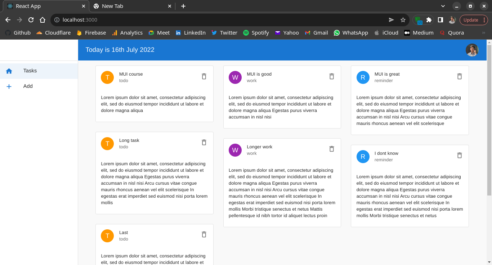
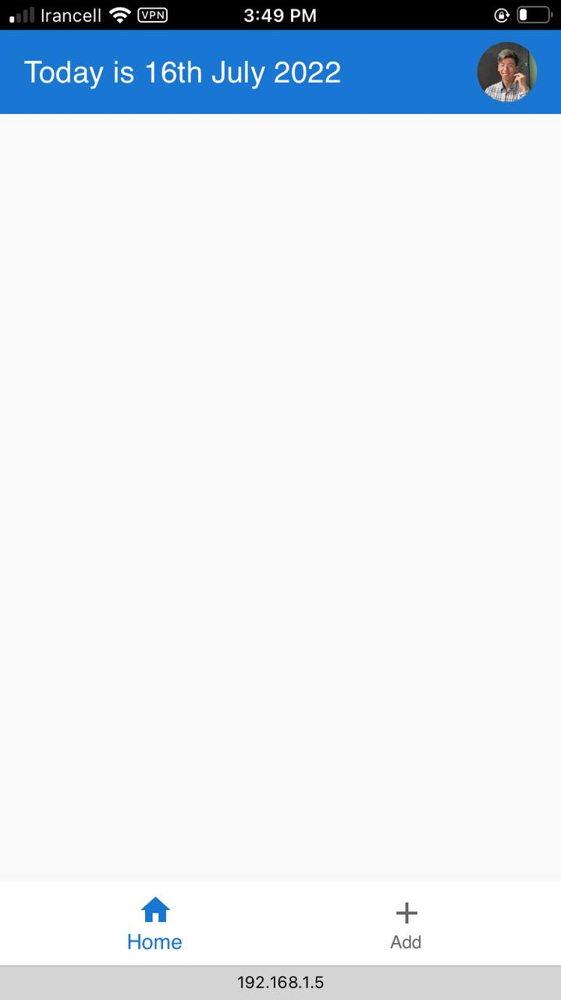
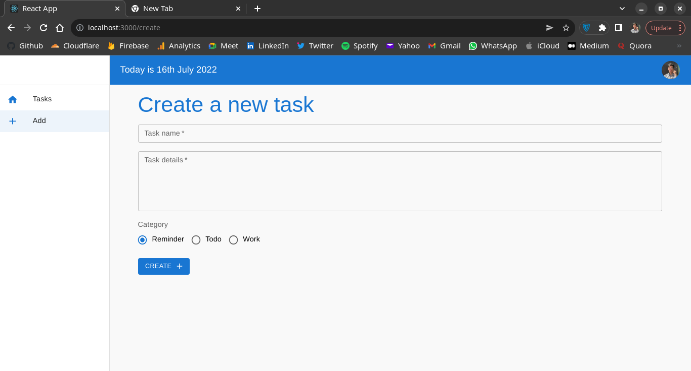
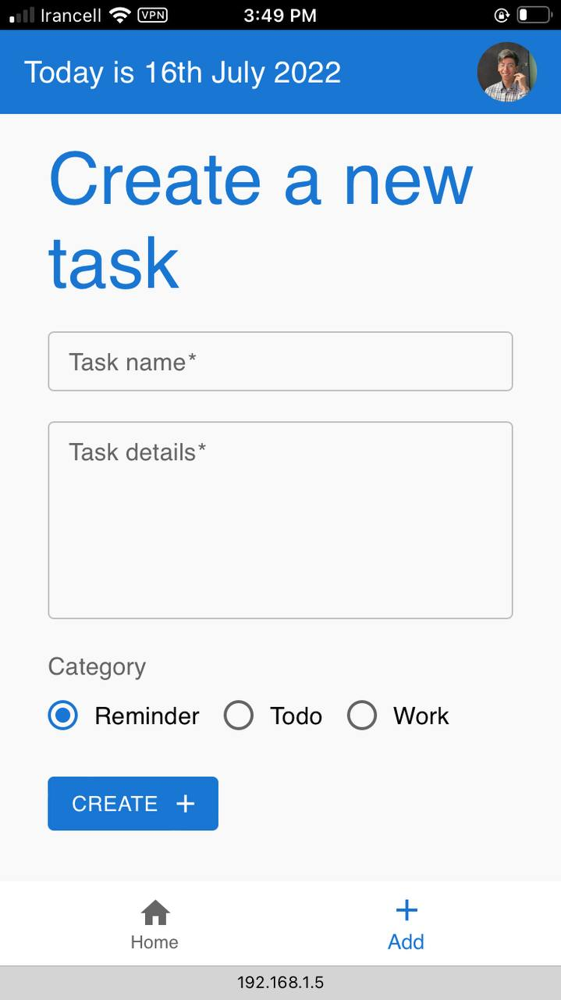

# React + MUI

In this course you learn how to use MUI components in your React applications. But, what is MUI?

> MUI offers a comprehensive suite of UI tools to help you ship new features faster. Start with Material UI, our fully-loaded component library, or bring your own design system to our production-ready components.

## JSON Server

I used a json server to store data in a json file. The structure of how to use the json server is like this:

```shell
npx json-server --watch <path> --port <port>
```

Like:

```shell
npx json-server --watch data/db.json --port 8000
```

## API

When we setup a json server, we need to use some methods to fetch data or post some data to it.

I usually use **Axios**. If you want to learn about Axios, check out [this course](https://github.com/BlackIQ/axios-blog) about **React + Axios**.

## Application

This is a TODO manager that I focused in **MUI**. Layout in web and mobile is different. How?

In web, we have a drawer like this:



But, in mobile, Drawer will be hide and a bottom navigation will be show!



Where we add task is a page you can see on the left side, if you go to the page, layout will be like this:



Layout in mobile has no differences with web.

